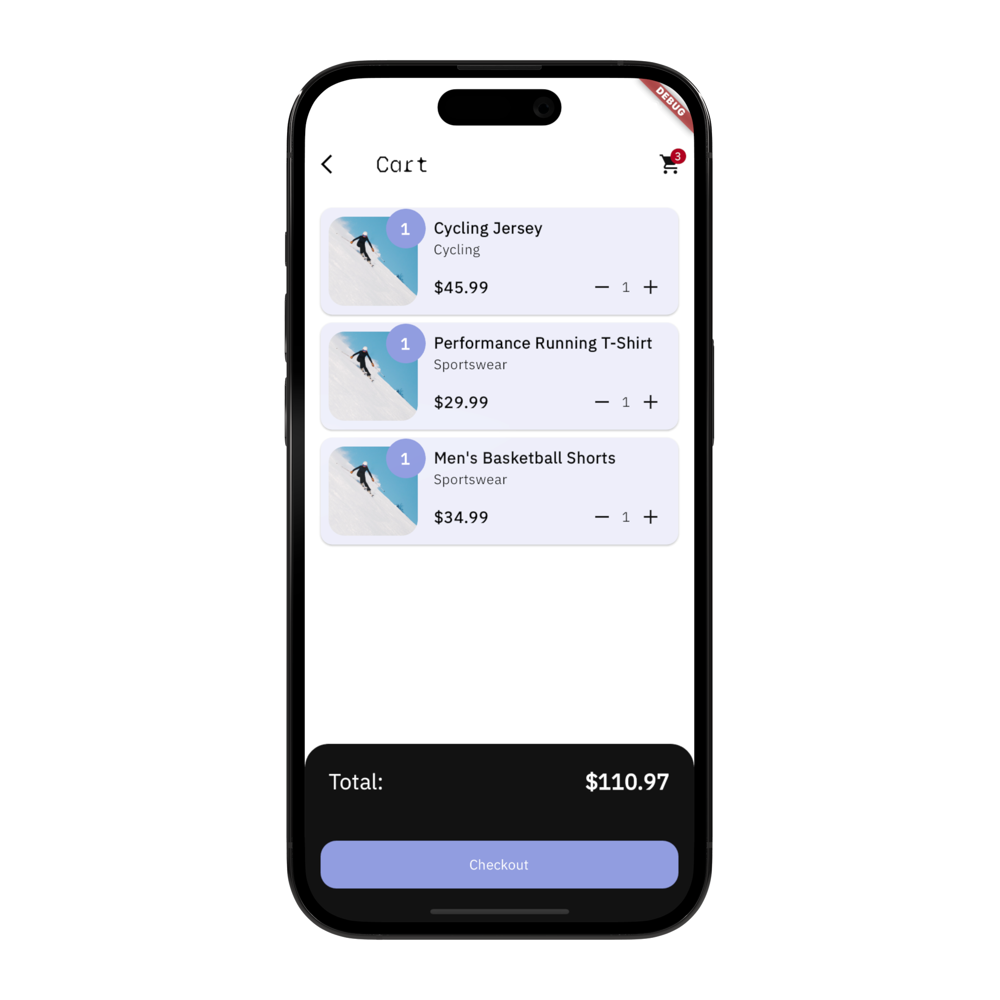
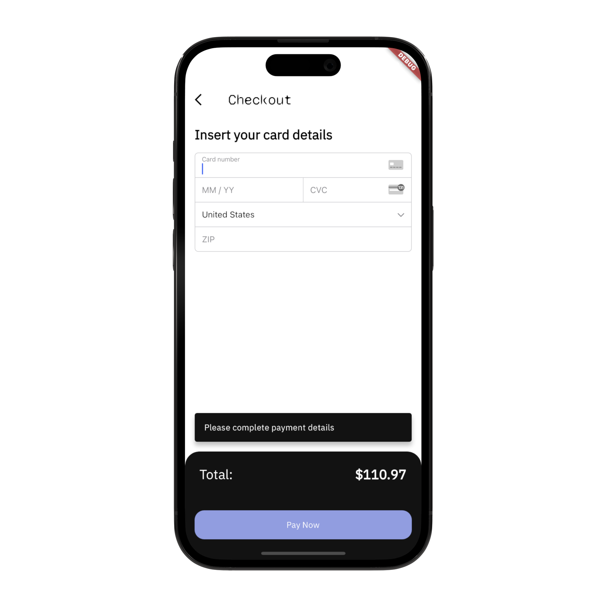
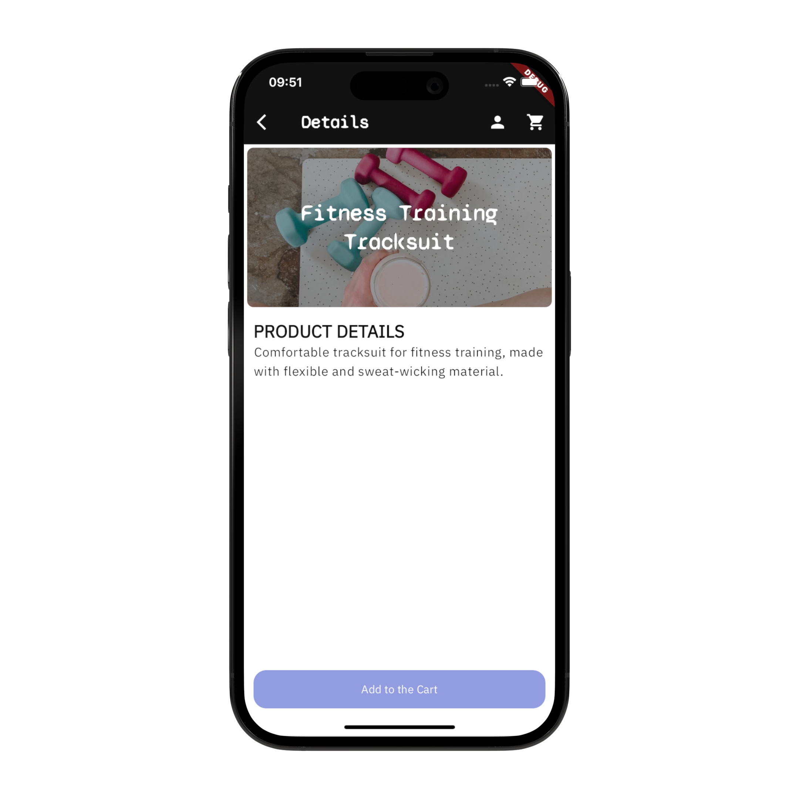
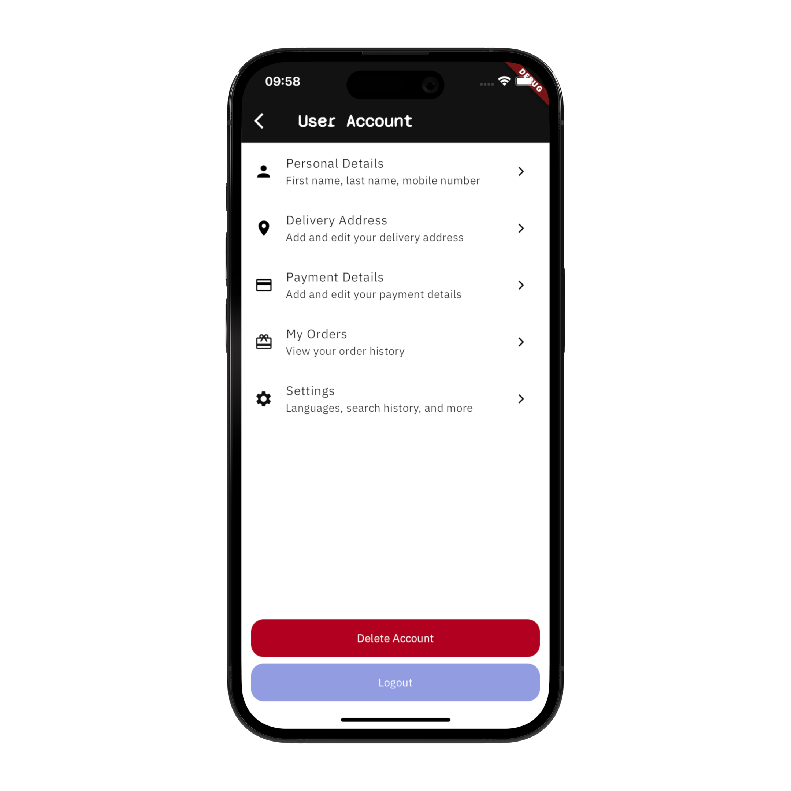
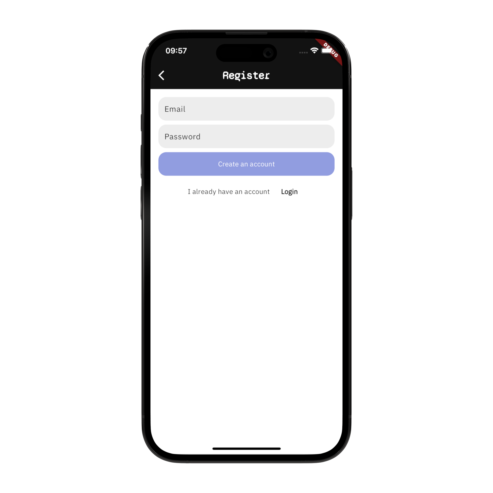
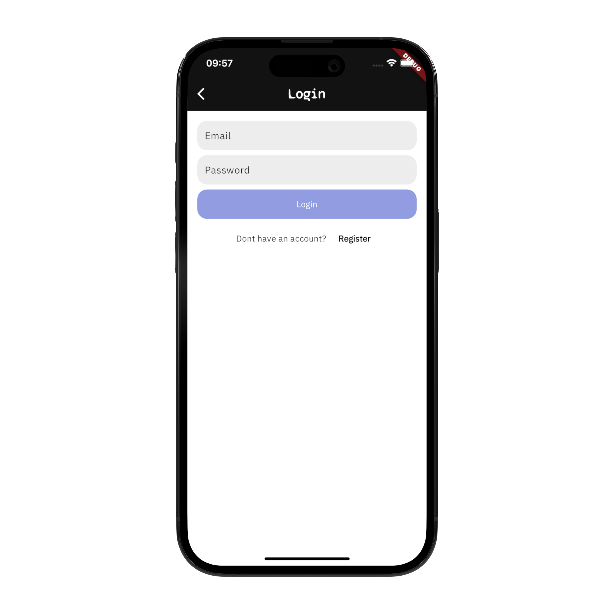

# Swap_tarou

このチュートリアルは、プロジェクトにカスタマイズできるシンプルなeコマースアプリの作り方を紹介することを目的としています。Flutterを使用して設計され、バックエンドにはFirebaseを使用しています。さらに、Stripeを使用して簡単に支払い処理を行うことができます。
リポジトリ内のコードは、Flutter、Firebase、およびStripeを使用したeコマースアプリのスターターコードです。ビデオに沿って進めるのに役立ちます。

- YouTube video: <https://youtu.be/xYgIY_1ulhw>

If you're looking for a more complete eCommerce App template:

- DynaMart: An eCommerce app template: <https://www.atomsbox.com/templates/dyna-mart>


## Screenshots

これらのスクリーンショットは、近日発売予定の最終的なeコマースアプリテンプレートを表しています。

## App Screenshots

| |  |  |
|:---:|:---:|:---:|
| Home Screen | Categories Screen | Catalog Screen |
|  |  |  |
| Cart Screen | Checkout Screen | Product Screen|
|  |  |  |
| User Account Screen | Register Screen | Login Screen|

## Getting Started

このテンプレートは、eコマースアプリプロジェクトの出発点を提供します。しかし、アプリを実行する前に、アプリがスムーズに動作することを確認するためにいくつかのステップを踏む必要があります。

### Step 1: Firebase Set-Up

このテンプレートは、認証、データベース、およびCloud Functionsを使用したサーバーレスバックエンドロジックの実行にFirebaseを使用します。

1. Firebaseプロジェクトを作成: Firebaseコンソールにアクセスし、新しいプロジェクトを作成します <https://console.firebase.google.com/>
2. Firebase Authを初期化し、「Email and Password」プロバイダを有効にします。
3. Cloud Firestoreを使用して新しいデータベースを初期化します。
4. Initialize Firebase in your app: <https://firebase.google.com/docs/flutter/setup?platform=ios>

### Step 2: Stripe Set-Up

テンプレートは、すべての支払い処理のニーズを処理するためにStripeを使用します。Stripeを統合するには：

1. stripe.comでアカウントを作成します。
2. Stripeの公開可能キーと秘密キーを取得します：<https://dashboard.stripe.com/test/apikeys（テスト用）>
3. .envファイルにStripeの公開可能キーを環境変数として追加します。
    - .example.envに移動し、.envに名前を変更します。
    - 公開可能キーの値を追加します。
    - enviedライブラリを使用してファイル 'lib/env.g.dart' を生成します：

```shell
dart run build_runner build
```

4. Google Cloudプロジェクトに移動します（新しいFirebaseプロジェクトを作成するとデフォルトで作成されます）、そしてSecret ManagerにStripeのシークレットキーを登録します。
    - API & Servicesに移動し、「Enable APIs and Services」をクリックしてSecret Manager APIを有効にします。
    - Google CloudプロジェクトでSecret Managerを開きます。
    - 名前を「STRIPE_SECRET_KEY」とし、値にStripeのシークレットキーを設定して新しいシークレットを作成します。

5. プロジェクトにflutter_stripeライブラリをセットアップします。
    - プラットフォーム固有の変更を実装する必要があります: <https://pub.dev/packages/flutter_stripe#installation>
    - Watch the video tutorial: <https://youtu.be/xYgIY_1ulhw>

### Step 3: Cloud Functions Set-Up

/*Start of Selection
このテンプレートは、支払いのバックエンドロジックを実行するためにFirebaseのCloud Functions（Python）を使用します。
End of Selection*/

1. Using the Firebase CLI, run:

```shell
firebase init functions 
```

2. Firebaseプロジェクトを選択します
3. 関数の言語としてPythonを選択します
4. 以下のスクリプトをmain.pyに使用します

```python
import stripe 

from firebase_functions import https_fn
from firebase_admin import initialize_app

# TODO: Use Secret Manager to safely store and access the Stripe Secret Key
STRIPE_SECRET_KEY = '...'
app = initialize_app()


@https_fn.on_request()
def stripe_pay_endpoint_method_id(req: https_fn.Request) -> https_fn.Response:
    print(req.method, req.get_json())

    if req.method != "POST":
        return https_fn.Response(status=403, response="Forbidden")

    data = req.get_json()
    payment_method_id = data.get('paymentMethodId')
    items = data.get('items')
    currency = data.get('currency')
    use_stripe_sdk = data.get('useStripeSdk')

    # TODO: Calculate the total price
    # You should always calculate the order total on the server to prevent
    # people from directly manipulating the amount on the client
    total = 1400

    try: 
        if payment_method_id:
            print(payment_method_id)
            params = {
                'payment_method': payment_method_id,
                'amount': total,
                'currency': currency,
                'confirm': True,
                'use_stripe_sdk': use_stripe_sdk,
                'automatic_payment_methods': {
                    'enabled': True,
                    'allow_redirects': 'never',
                },
            }
            intent = stripe.PaymentIntent.create(api_key=STRIPE_SECRET_KEY, **params)
            # return https_fn.Response(status=200, response=intent)
            return _generate_response(intent)
        else:
            return https_fn.Response(status=400, response="Bad request")

    except Exception as e: 
        return https_fn.Response(status=500, response=str(e))

        

# @https_fn.on_request()
# def stripe_pay_endpoint_intent_id(req: https_fn.Request) -> https_fn.Response:
    # return ...


def _generate_response(intent):
    if intent.status == "requires_action":
        return {
            "clientSecret": intent.client_secret,
            "requiresAction": True,
            "status": intent.status,
        }
    elif intent.status == "requires_payment_method":
        return {"error": "Your card was denied, please provide a new payment method"}
    elif intent.status == "succeeded":
        print("💰 Payment received!")
        return {"clientSecret": intent.client_secret, "status": intent.status}
    else:
        return {"error": "Failed"}
```

5. Add Stripe as a dependency to your project

```shell
cd functions

# Start the virtual environment for the functions
source venv/bin/activate

# Add the dependency 
pip install stripe

# Update the list of dependencies in the requirements.txt
pip freeze > requirements.txt

# Close the virtual environment
deactivate

```

6. Deploy the functions to Firebase

```shell
firebase deploy --only functions
```

7. Get the function endpoint URL from Firebase. Use your Cloud Function's URLs in the payment client `packages/payment_client/lib/src/payment_client.dart`

```dart
// TODO: Add your Cloud Functions URLs here
const ENDPOINT_METHOD_ID_URL =
    "...";

const ENDPOINT_INTENT_ID_URL =
    "...";
```

### Step 4: Set up the Cloud Firestore Data Bundles

/* Start of Selection
eCommerceはデータバンドルを使用してカテゴリーデータをロードします。Cloud FirestoreのデータはFirestore Bundle Builder拡張機能を使用して静的データファイルにエクスポートされます。

1. 拡張機能をFirebaseプロジェクトにインストールします: <https://firebase.google.com/docs/extensions/official/firestore-bundle-builder>
2. ビデオチュートリアルを視聴します: <https://youtu.be/xYgIY_1ulhw>
3. Firebaseから関数エンドポイントURLを取得します。Cloud FunctionのURLを使用して、カテゴリリポジトリ `lib/repositories/category_repository.dart` で静的ファイルを取得します。

```dart

  Future<List<Category>> fetchCategories() async {
    try {
      final categoriesData = await dbClient.fetchAllFromBundle(
        collection: 'categories',
        // TODO: Add your bundle URL here
        bundleUrl: '...',
      );
      return categoriesData
          .map<Category>((categoryData) =>
              Category.fromJson(categoryData.data, id: categoryData.id))
          .toList();
    } catch (err) {
      throw Exception('Failed to fetch the categories: $err');
    }
  }
```
